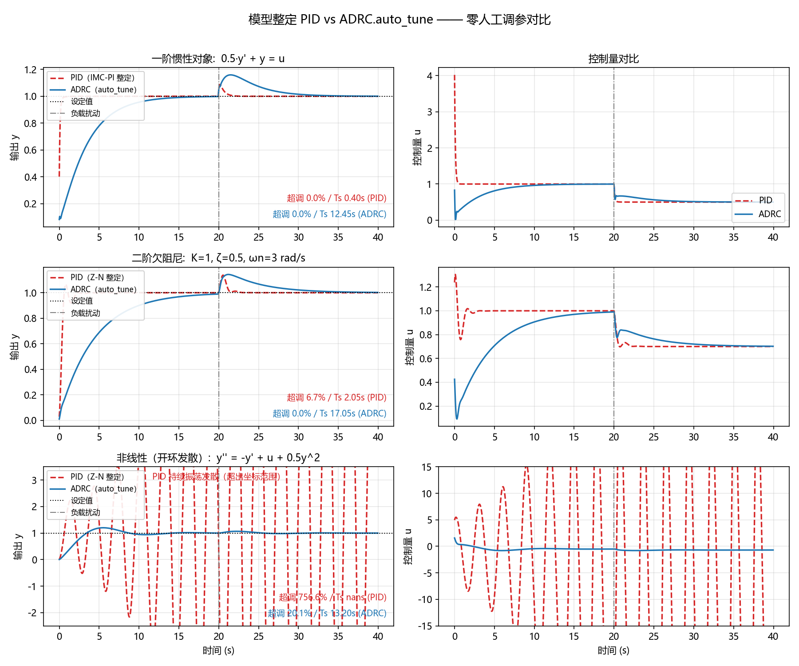
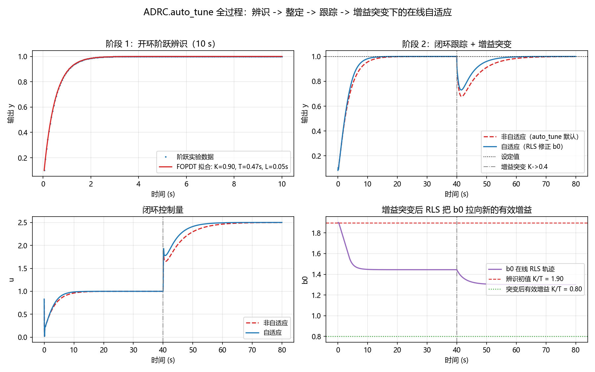
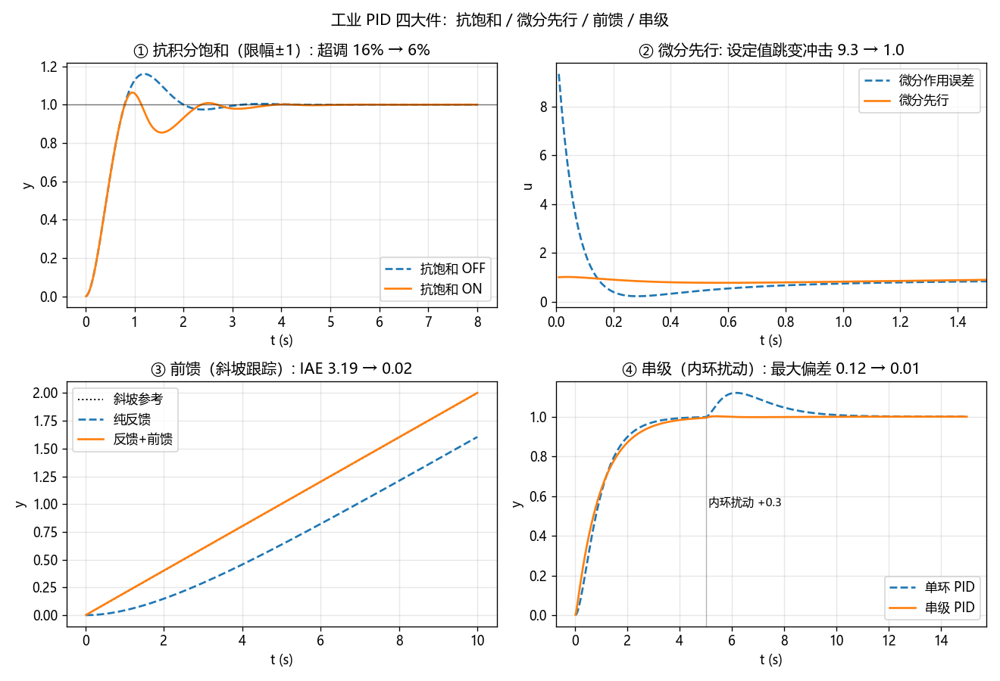
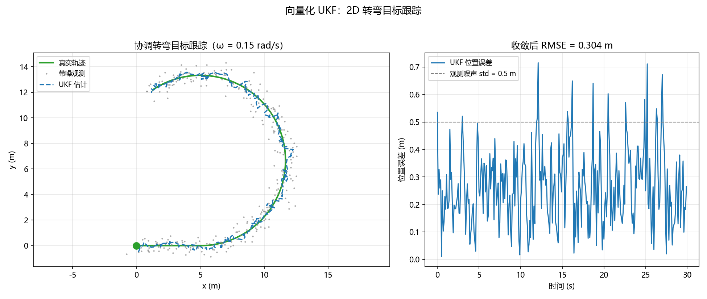
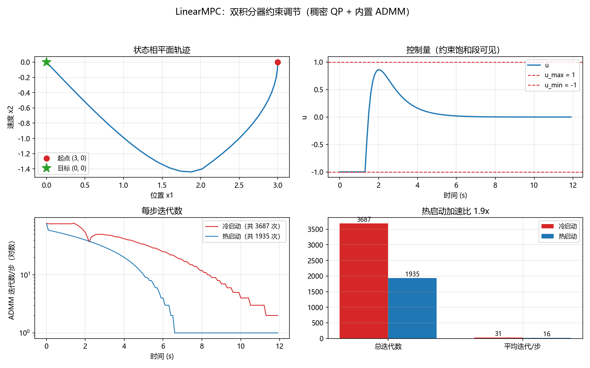

# classic_controlling

**Self-tuning ADRC, industrial PID (cascade / feedforward / derivative-on-measurement), vectorized UKF, and dependency-free MPC — classic control algorithms in pure NumPy, with benchmarks.**




> **Zero manual tuning:** `ADRC.auto_tune()` identifies the plant and reaches steady-state <5% error on first-order, second-order and nonlinear plants — blind-tested. Above: model-tuned PID vs zero-touch ADRC on three plants, with a step load disturbance at t=20s. On the open-loop-unstable nonlinear plant the Z-N tuned PID diverges into growing oscillation; the auto-tuned ADRC just locks on.

## Features

- **Self-tuning ADRC** (`ADRC.auto_tune`) — one step-response experiment → FOPDT identification → bandwidth selection under delay phase-margin/sampling hard-constraints. Steady-state error **0.9% / 3.2% / 1.0%** on the three blind-test plants, zero human parameters. Optional online RLS correction of b0 (experimental, off by default): rate-limited two-timescale updates, [0.3, 3.0]× rails, and automatic rollback-and-freeze if the estimate hugs a rail while tracking stagnates.
- **Industrial PID** (`PID` / `CascadePID`) — derivative-on-measurement (kills the setpoint-kick: u spike **9.3 → 1.0**), filtered derivative, output limits with back-calculation anti-windup (overshoot **16.0% → 6.3%** under ±1 saturation), additive feedforward (`step(r, y, ff=...)`, ramp-tracking IAE **3.19 → 0.02**), setpoint weighting, and cascade composition (inner-disturbance max deviation **0.12 → 0.006**). Built-in Ziegler-Nichols and IMC-PI tuning rules.
- **Vectorized UKF** — every sigma-point operation (generation, batch propagation, weighted mean/covariance rebuild) is one NumPy broadcast/einsum, no per-point Python loop: **2.2× / 6.0× / 11.2×** faster than a mathematically equivalent point-loop reference at dim_x = 2 / 8 / 32.
- **Dependency-free LinearMPC** — condensed QP compiled once, built-in OSQP-style ADMM solver with pre-factored KKT matrix, warm start over (z, s, y) cutting total iterations **1.9×** (3687 → 1935) on a constrained double integrator. No external solver (no OSQP/CVXPY) needed.

## Quick Start

```bash
pip install classic-controlling        # or: pip install -e . from source
python -m pytest tests/ -v             # 32 tests
```

### ADRC — 5 lines to a self-tuned loop

```python
from classic_controlling import ADRC, FOPDTPlant

plant = FOPDTPlant(gain=1.0, time_constant=0.5, dt=0.05)
ctl = ADRC.auto_tune(plant, dt=0.05)        # identify + tune, zero knobs
                                            # (online RLS: opt-in via adaptive=True)
for _ in range(300):
    u = ctl.step(r=1.0, y=plant.y)
    plant.step(u)
```

The full auto-tuning pipeline (step test → FOPDT fit → tracking → b0 adapting to a mid-run gain change), from `examples/demo_autotune.py`:



### PID — the industrial essentials, included

```python
from classic_controlling import PID, CascadePID

ctl = PID(kp=3.0, ti=0.5, td=0.1, dt=0.01, u_min=-1, u_max=1)  # anti-windup on by default
u = ctl.step(r=1.0, y=plant.y, ff=model_feedforward)           # feedforward is one kwarg

cascade = CascadePID(outer=PID(1.0, 1.0, 0.0, dt),             # outer output = inner setpoint
                     inner=PID(5.0, 0.2, 0.0, dt))
u = cascade.step(r=1.0, y_outer=pos, y_inner=vel)
```

From `examples/demo_pid_features.py` — anti-windup / derivative-on-measurement / feedforward / cascade, each against its own ablation:



### UKF — vectorized sigma points

```python
import numpy as np
from classic_controlling import UKF

def fx(sigmas, dt):                     # (2n+1, 4) batch in, batch out
    out = sigmas.copy()
    out[:, 0] += dt * sigmas[:, 2]; out[:, 1] += dt * sigmas[:, 3]
    return out

ukf = UKF(4, 2, 0.1, fx, hx=lambda s: s[:, :2], Q=np.eye(4)*0.01, R=np.eye(2))
ests = ukf.batch_filter(zs)             # zs: (N, 2) position measurements
```

From `examples/demo_ukf.py` — coordinated-turn tracking, RMSE 0.30 m under 0.5 m observation noise:



### LinearMPC — constrained MPC without a solver dependency

```python
import numpy as np
from classic_controlling import LinearMPC

A = np.array([[1.0, 0.1], [0.0, 1.0]]); B = np.array([[0.005], [0.1]])
mpc = LinearMPC(A, B, Q=np.eye(2), R=[[0.1]], horizon=40, u_min=-1.0, u_max=1.0)
x = np.array([3.0, 0.0])
for _ in range(120):
    x = A @ x + B @ mpc.solve(x, warm_start=True)
```

From `examples/demo_mpc.py`:



## Benchmarks

### Vectorized UKF vs point-loop reference

`python benchmarks/bench_ukf.py` — 1000 predict+update steps each, mathematically equivalent implementations (Python 3.13.5 / NumPy 2.3.3, Windows):

| dim_x | vectorized (s) | point-loop (s) | speedup |
|------:|---------------:|---------------:|--------:|
|     2 |         0.0392 |         0.0855 |    2.2× |
|     8 |         0.0439 |         0.2623 |    6.0× |
|    32 |         0.1079 |         1.2066 |   11.2× |

The point-loop overhead grows linearly with `2n+1` sigma points; the vectorized path is eaten by BLAS.

### `auto_tune` blind test

Zero human parameters; the plants' true parameters are used only for assertions (`tests/test_autotune.py`, 300 closed-loop steps at dt=0.05):

| plant | model | steady-state error |
|---|---|---:|
| FOPDT | `0.5·ẏ + y = u` | 0.89% |
| second-order underdamped | `ζ=0.5, ωn=3` | 3.21% |
| nonlinear, open-loop unstable | `ÿ = -ẏ + u + 0.5y²` | 1.03% |

### MPC warm start

Constrained double integrator, horizon 40, 120 closed-loop steps (`examples/demo_mpc.py`):

| | total ADMM iters | mean iters/step |
|---|---:|---:|
| cold start | 3687 | 30.7 |
| warm start | 1935 | 16.1 |
| **speedup** | **1.9×** | **1.9×** |

### ADRC.auto_tune vs model-tuned PID

Step tracking `r=1` with a step load disturbance at t=20s (`examples/demo_adrc_vs_pid.py`; PID tuned from the *same* step-test data via Ziegler-Nichols reaction-curve rules, IMC-PI fallback when the identified delay ≈ 0):

| plant | controller | overshoot | settling (s) | disturbance recovery (s) | IAE |
|---|---|---:|---:|---:|---:|
| FOPDT | PID (IMC-PI) | 0.0% | 0.40 | 0.55 | 0.15 |
| FOPDT | ADRC | 0.0% | 12.45 | 6.25 | 4.12 |
| 2nd-order | PID (Z-N) | 6.7% | 2.05 | 1.05 | 0.51 |
| 2nd-order | ADRC | 0.0% | 17.05 | 6.35 | 5.06 |
| nonlinear | PID (Z-N) | 757% | — | ∞ | 170.86 |
| nonlinear | ADRC | 20.1% | 13.20 | 3.55 | 2.89 |

Honest read: on well-behaved LTI plants a model-tuned PID is faster — ADRC's auto-bandwidth trades speed for guarantees (the delay phase-margin cap is calibrated against measured divergence, not folklore). The trade: ADRC never rings, needs zero expertise, and is the only one left standing on the open-loop-unstable nonlinear plant.

## Examples

```bash
python examples/demo_adrc_vs_pid.py    # hero comparison + metrics table
python examples/demo_autotune.py       # auto_tune pipeline end-to-end
python examples/demo_pid_features.py   # anti-windup / D-on-meas / feedforward / cascade
python examples/demo_mpc.py            # constrained MPC + warm-start speedup
python examples/demo_ukf.py            # coordinated-turn tracking
```

All figures are written to `docs/figures/`.

## Project layout

```
classic_controlling/      # the package
├── adrc.py               # linear ADRC (bandwidth tuning + auto_tune + RLS b0 adaptation)
├── autotune.py           # step-response FOPDT identification + automatic bandwidth selection
├── pid.py                # industrial PID (anti-windup / D-on-measurement / feedforward) + CascadePID
├── sim.py                # virtual plants (FOPDT / 2nd-order / nonlinear), reset()/step(u) protocol
├── ukf.py                # vectorized UKF
└── mpc.py                # LinearMPC (condensed QP + built-in ADMM + warm start)
tests/                    # 32 pytest tests (blind auto-tune assertions, SLSQP cross-check, PID ablations, ...)
benchmarks/bench_ukf.py   # UKF vectorized vs point-loop benchmark
examples/                 # runnable demos -> docs/figures/*.png
research/                 # background research notes (Chinese)
```

## 中文简介

三个经典控制/估计算法的高质量纯 NumPy 实现：

- **工业 PID**：`PID` 内置微分先行（设定值跳变冲击 9.3 → 1.0）、微分滤波、限幅 + 反算抗饱和（±1 限幅下超调 16.0% → 6.3%）、前馈叠加（斜坡跟踪 IAE 3.19 → 0.02）、设定值权重；`CascadePID` 串级（内环扰动最大偏差 0.12 → 0.006）；自带 Z-N / IMC-PI 整定规则；
- **自整定 ADRC**：`ADRC.auto_tune(plant, dt)` 一键完成阶跃辨识 → FOPDT 拟合 → 带宽自动选择（时滞相位裕量帽 + 采样硬约束），全程零人工调参；一阶/二阶/非线性三个对象盲测稳态误差 0.9% / 3.2% / 1.0%。在线 RLS 修正 b0 为 experimental 可选项（默认关闭）：限速双时间尺度更新 + [0.3, 3.0]× 护栏 + 贴护栏停滞自动回退冻结；
- **向量化 UKF**：sigma 点操作全部 NumPy 广播一次完成，无逐点循环，相比等价逐点实现加速 2.2× / 6.0× / 11.2×（dim 2/8/32）；
- **轻量线性 MPC**：稠密式 QP 编译一次 + 内置 OSQP 风格 ADMM 求解器 + (z, s, y) 热启动（总迭代数减 1.9×），零外部求解器依赖。

快速开始：

```bash
pip install -e .
python -m pytest tests/ -v          # 32 项测试
python examples/demo_adrc_vs_pid.py # 核心对比演示，出图到 docs/figures/
```

## Roadmap

- Upstream the vectorized UKF sigma-point path as a PR to `filterpy`
- Optional Numba backend for the MPC ADMM iterations (per-iteration cost → microseconds)
- More virtual plant types (integrating, oscillatory, MIMO) and ADRC tracking of time-varying references

## License

MIT — see [LICENSE](LICENSE). Contributions welcome: [CONTRIBUTING.md](CONTRIBUTING.md).
